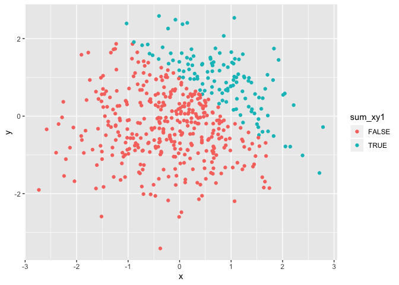
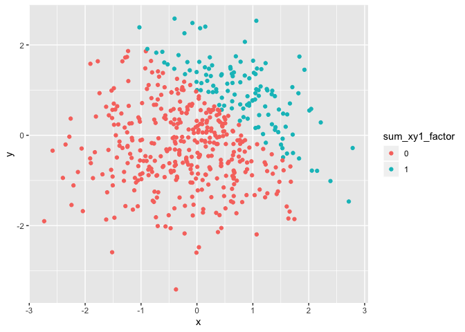

p8105\_hw1\_jc4166
================
Jerri Chen
2019\_09-16

## Problem 1

Create a data frame comprised of the following:

  - a random sample of size 8 from a standard Normal distribution  
  - a logical vector indicating whether elements of the sample are
    greater than 0  
  - a character vector of length 8  
  - a factor vector of length 8, with 3 different factor “levels”

<!-- end list -->

``` r
problem1_df = tibble(
  norm_samp = rnorm(8),
  norm_samp_pos = norm_samp > 0,
  vec_char = c("My", "name", "is", "Jerri", "Chen", "MD", "PhD", "MS"),
  vec_factor = factor(c("A", "B", "C", "A", "B", "C", "A", "B"))
)
```

Take the mean of each variable in the problem1\_df.

  - The mean of the numeric variable is 0.181976.
  - The mean of the logical variable is 0.625.
  - The mean of the character variable is NA.
  - The mean of the factor variable is NA.

I am unable to take the mean of the character or vector variable because
they are not numeric.

The following code chunk demonstrates the as.numeric function on the
variables from problem1\_df.

``` r
problem1_numeric_df = tibble(
  norm_samp = rnorm(8),
  norm_samp_pos = as.numeric(norm_samp > 0),
  vec_char = as.numeric(c("My", "name", "is", "Jerri", "Chen", "MD", "PhD", "MS")),
  vec_factor = as.numeric(factor(c("A", "B", "C", "A", "B", "C", "A", "B")))
)
```

The following code chunk demonstrates conversion and nested conversion
of logical variables from problem1\_df, with column cross products.

``` r
problem1_convert_df = tibble(
  norm_samp = rnorm(8),
  norm_samp_pos_numeric = as.numeric(norm_samp > 0),
  Product1 = norm_samp*norm_samp_pos_numeric,
  norm_samp_pos_factor = as.factor(norm_samp > 0),
  Product2 = norm_samp*norm_samp_pos_factor,
  norm_samp_pos_factor_num = as.numeric(as.factor(norm_samp > 0)),
  Product3 = norm_samp*norm_samp_pos_factor_num
)
```

## Problem 2

Create a data frame comprised of the following:

  - x: a random sample of size 500 from a standard Normal distribution  
  - y: a random sample of size 500 from a standard Normal distribution  
  - A logical vector indicating whether x + y \> 1  
  - A numeric vector created by coercing the above logical vector  
  - A factor vector created by coercing the above logical vector

<!-- end list -->

``` r
problem2_df = tibble(
  x = rnorm(500),
  y = rnorm(500),
  sum_xy1 = x + y > 1,
  sum_xy1_numeric = as.numeric(x + y > 1),
  sum_xy1_factor = as.factor(sum_xy1_numeric)
)
```

  - The number of rows is 500.
  - The number of columns is 5.
  - The mean of x is 0.0137073.
  - The median of x is 0.0395371.
  - The standard deviation of x is 0.962829.
  - The proportion of cases for which x + y \> 1 is 0.244.

Scatter plot adding color using logical variable:

``` r
ggplot(problem2_df, aes(x = x, y = y, color = sum_xy1)) + geom_point()
```

<!-- -->

``` r
ggsave("scatter_plot.pdf", height = 4, width = 6)
```

Scatter plot adding color using numeric
variable:

``` r
ggplot(problem2_df, aes(x = x, y = y, color = sum_xy1_numeric)) + geom_point()
```

<!-- -->

Scatter plot adding color using factor
variable:

``` r
ggplot(problem2_df, aes(x = x, y = y, color = sum_xy1_factor)) + geom_point()
```

<!-- -->

The color scales of the above scatter plots indicate the type of
variables included. The numeric variable is represented by a gradient
color scale for continuous data, whereas the factor and logical
variables are two individual colors representing categorical data.
